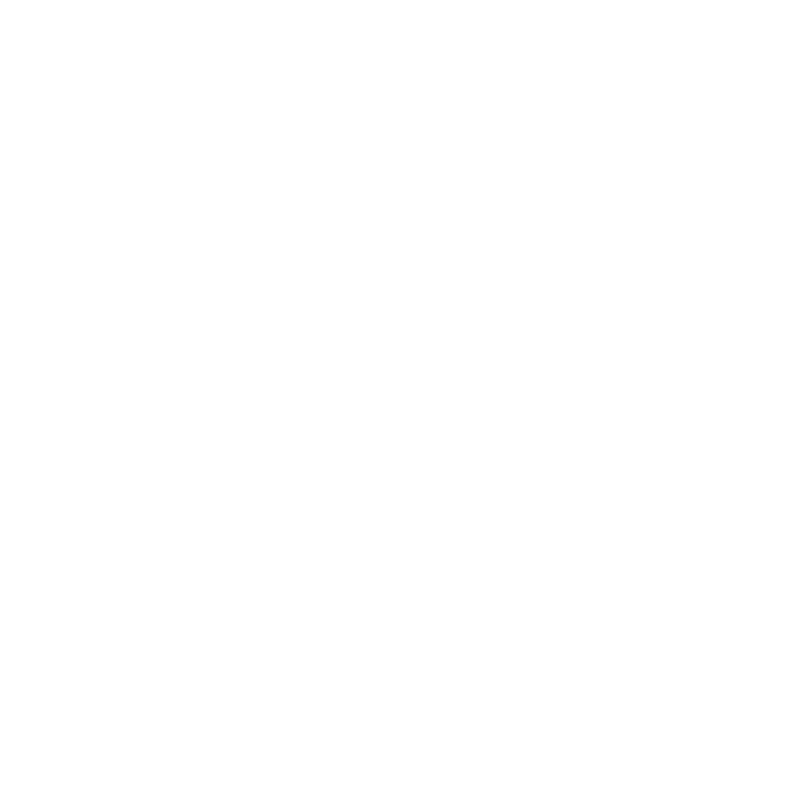
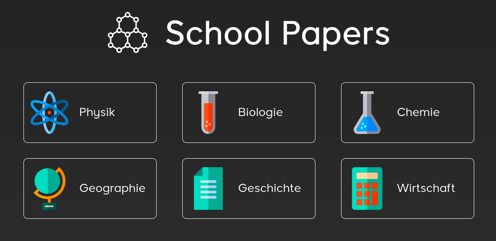

  
  
  
  
  

 

  

  <h3 align="center">School Papers</h3>

  

    An awesome website that has the sumarization for a lot of school subjects
     
    <a href="https://schoolpapers.org">View Website</a>
    ·
    <a href="https://github.com/adkoprek/SchoolPapers/issues/new?labels=bug&template=bug-report---.md">Report Bug</a>
    ·
    <a href="https://github.com/adkoprek/SchoolPapers/issues/new?labels=enhancement&template=feature-request---.md">Request Feature</a>
  

<!-- ABOUT THE PROJECT -->
## About The Project

  

When I attended [Middle School in Turgi](https://www.schule-baden.ch/ueber-uns/sek-i-standort-turgi/) I was wraiting sumarization for most of the examinations for the subjscts: physics, biology, chemistry, history, geography and economy. 
After graduation I desited to clean up all of this files put them in one format and create a website so you don't have to write them. Now I'm currently going to [High School in Wettingen](https://kswe.ch/) and will probably continue with writing 
the sumarization for the examinations to come.

### Built With

[![HTML][HTML.js]][HTML-url]
[![CSS][CSS.js]][CSS-url]
[![JavaScript][JavaScript.js]][JavaScript-url]

## Usage

You can open this website over this [link](https://schoolpaper.org)

## Contributing

Contributions are what make the open source community such an amazing place to learn, inspire, and create. Any contributions you make are **greatly appreciated**.

If you have a suggestion that would make this better, please fork the repo and create a pull request. You can also simply open an issue with the tag "enhancement".
Don't forget to give the project a star! Thanks again!

1. Fork the Project
2. Create your Feature Branch (`git checkout -b feature/AmazingFeature`)
3. Commit your Changes (`git commit -m 'Add some AmazingFeature'`)
4. Push to the Branch (`git push origin feature/AmazingFeature`)
5. Open a Pull Request

## License

Distributed under the MIT License. See `LICENSE.txt` for more information.

## Contact

Contanct information can be extracted from the [impresuum](https://schoolpapers.org/impressum/impressum)

[HTML.js]: https://img.shields.io/badge/HTML5-E34F26?style=for-the-badge&logo=html5&logoColor=white
[HTML-url]: https://html.com
[CSS.js]: https://img.shields.io/badge/CSS3-1572B6?style=for-the-badge&logo=css3&logoColor=white
[CSS-url]: https://css.com
[JavaScript.js]: https://img.shields.io/badge/JavaScript-323330?style=for-the-badge&logo=javascript&logoColor=F7DF1E
[JavaScript-url]: https://en.wikipedia.org/wiki/CSS
[JQuery.com]: https://img.shields.io/badge/jQuery-0769AD?style=for-the-badge&logo=jquery&logoColor=white
[JQuery-url]: https://jquery.com 
