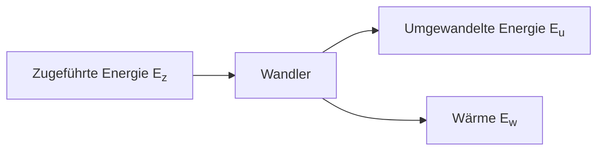
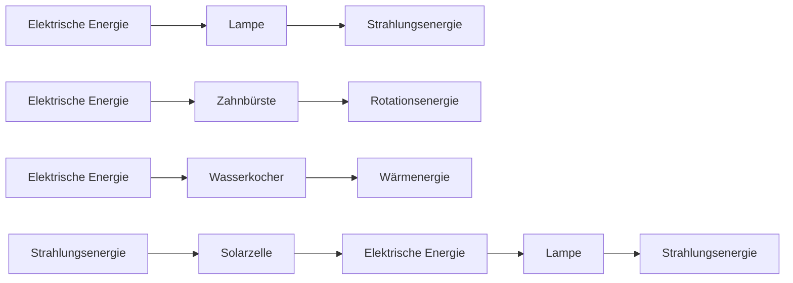

# Energie

### Allgemein

### Du kennst die Energieformen und Energiewandler und kannst Beispiele dazu machen

- Schallenergie -> Instrument

- Kinetische Energie (Bewegungsenergie) -> Mensch beim rennen

- Spannenergie -> Bogen

- Rotationsenergie -> Windrad

- Wärmeenergie -> Herd

- Strahlungsenergie -> Heizung

- Elektrische Energie -> Strom

- Chemische Energie -> Treibstoff

- Energiewandler -> Nehmen Energie auf und verarbeiten diese zu einer anderen Energieform (Wärme als Nebenprodukt)
  
  - Solaranlage
  
  - Klimaanlage
  
  - Auto
  
  - Glühbirne

### Du kennst den Energieerhaltungssatz und kannst Energieflussdaigramme zeichnen

Die Energie bleibt in einem Isolierten System immer gleich (Energie Formen dürfen sich verändern)

$$
E_z=E_u+E_w
$$

### Du kennst die Begriffe zugeführte Energie und nutzbare Energie und kannst Beispiele dazu machen

Damit Energie umgewandelt werden kann braucht es eine Eingang bzw. Start Energie (zugeführte Energie), diese wird jeweils umgewandelt in einen anderen Energietyp. Bei einer solcher Umwandlung entsteht, aber Wärme als Nebenprodukt. Eines der Ziel, der heutigen Forschung ist es Diese Wärme so stark wie möglich zu minimieren, bei Energiewandler.

### Du kennst Beispiele Aktivierungsenergie und Katalysator im Zusammenhang mit chemischen Reaktionen

- `Aktivierungsenergie` ist Energie, die eingesetzt werden muss, damit eine chemische Reaktion stattfinden kann
  
  - Zündhölzchen, bei Kerze
  
  - Energie aus der umgebenden Luft, beim Rosten
  
  - Knicken von Leuchtstäben

- `Katalysatoren` Sind Stoffe welche verbunden mit anderen ihre Aktivierungsenergie senken.
  
  - Zersetzen von Stoffen im Auspuff, bei Raumtemperatur 
  
  - Schmelzen von Eis mit Salz, bei unter 0°C

### Du kennst die Begriffe exotherme und endotherme Reaktionen und kannst sie beschreiben und in einem Energiediagrammen darstellen

Bei `exothermen` Reaktionen wird eine gewisse Aktivierungsenergie gebraucht, damit die chemische Reaktion startet, diese Reaktion muss sich selber ohne Energiequelle weiter erhalten können. Dabei wird Energie frei.

- Kohle auf dem Grill

- Heizen im Ofen

- Sprengstof

Bei einer `Endothermen` Reaktion, nimmt ein Stoff Energie auf, dabei muss im Energie 
hinzugeführt werden (Aktivierungsenergie). Diese Reaktion stoppt, nachdem keine Energie ihm mehr hinzugefügt wird.

- Photosysnthese

## Periodensystem der Elemente (PSE)

### Du kannst das Ordnungssystem des PSE erklären: Perioden, Gruppen, Metalle, Halbmetalle, Nichtmetalle

- Elemente im PSE gehören immer zu einer `Zeile (Periode)`. Alle Elemente in einer Periode haben die gleiche Anzahl Elektronenschalen in ihrer Hülle.

- Gruppen -> Elemente im PSE gehören immer zu einer `Spalte (Gruppe)`. Elemente die in derselben Spalte stehen haben ähnlich chemische Eigenschaften, dies heisst, dass sie z. B. in chemischen Reaktionen ähnlich reagieren.
  
  - Halogene (Salzbildner) VII, reagieren gerne mit Metallen, Salzen
  
  - Edelgase VIII, reagieren mit keinem Stoff, weil es 8 Valenzelektrone gibt

- Stoffe im Periodensystem, können Metalle, Halbmetalle und Nichtmetalle sein.
  
  - Metalle
    
    - Wärme und elektrische Leitfähigkeit
    
    - Metallglanz
    
    - Verformbar (brechen nicht)
  
  - `Nichtmetallen` fehlen die Eigenschaften, der Metalle
  
  - `Halbmetalle` sind Stoffe, welche Eigenschaften von Metallen und Nichtmetallen aufweisen.

### Du weisst welche Angaben und Grössen von einem Atom man aus dem PSE herauslesen kann

- Die `Ordnungszahl` ist die Anzahl Protonen oder Elektronen in einem Atom

- Die `Atommasse` ist gerundet die Anzahl Protonen und Neutronen im Atomkern und drückt das Gewicht eines Elementes aus in *u*

## Chemische Reaktionen

### Du kannst erklären, was eine chemische Reaktion ist, kennzeichnet und kannst die Kennzeichen an einfachen Beispielen erklären

- Kennzeichen einer `chemischen Reaktion`: Bei chemischen Reaktionen trennen sich und entstehen Verbindungen zwischen Elementen oder Molekülen, dabei muss Energie freigesetzt oder aufgenommen werden. Bei chemischen Reaktionen verändert sich der Stoff und die Edukte können sich stark von den Produkten unterscheiden.

- `Physikalische Reaktionen` zählen nicht zu chemische Reaktionen, weil sich dabei nur der Aggregatzustand ändert.

### Du kannst das Verbrennen von Kerzenwachs beschreiben und die chemische Reaktion notieren

Billige Kerzen bestehen aus Paraffin, dies ist ein Nebenprodukt, bei der Destillation von Erdöl. Paraffin ist Kohlenwasserstoff $ \ce{Cn + H_{2n + 2}} $. Beim anzünden einer Kerze verbrennt verdammt der im Docht enthaltene Wachs schlagartig und erwärmt, die Umgebung des Dochtes. Der Docht saugt sich wieder mit diesem geschmolzenem Wachs voll. Beim untersten Teil des Dochts steigen die Dämpfe vom Wachs auf, wodurch dort keine Verbrennung möglich ist (=> Verdrängung von Sauerstoff), deshalb brennt der Docht nicht ab. Der gasförmige hochsteigende Wachs oxidiert schlagartig mit Luft bei hohen Temperaturen und absorbiert dabei Elektromagnetische. Wenn der Kohlenwasserstoff nicht vollständig verbrennt, können Überreste in Form von Kohlenstoff entstehen, auch Russ genannt. Wenn die Kerze 
vollständig verbrennt entsteht nur $ \ce{CO2} $ .

$$
\ce{Cn H_{2n+2} + O2 -> CO2 + H2O - E}
$$

### Du weisst, was eine Oxidation ist, und kennst Beispiele dazu

Bei einer Oxidation reagiert ein Stoff mit Sauersoff. 

- Bie der `Verbrennung` nehmen Stoffe bei hohen Temperaturen Sauerstoff schlagartig auf

- Beim `Rosten` reagieren Metalle mit Sauerstoff und Wasser aus der Umluft und bildet Eisenoxide

### Du weisst, was eine Elektrolyse ist und wie man Wasser zerlegt

Bei der Elektrolyse werden mithilfe vom elektrischen Strom chemische Verbindungen aufgetrennt Wasser H2O besteht aus Wasserstoff und Sauerstoff, diese beiden Stoffe sind Gase. Mit der Elektrolyse können diese beiden Stoffe getrennt werden. Beim Minuspol sammelt sich der Wasserstoff und beim Pluspol der Sauerstoff. Diese Funktionalität erfüllt der Hofmannsche Wasserzersetzungsapparat.

### Du kennst die Begriffe Synthese und Analyse

- Die `Synthese` ist eine chemische Reaktion bei der sich Elemente oder Moleküle verbinden

- Die `Analyse` ist eine chemische Reaktion bei der Elemente oder Moleküle sich trennen

### Du kannst die Reaktion von Wasserstoff und Sauerstoff beschreiben, du weisst, wozu man es verwenden kann und wie man diese Elemente nachweist

- Wenn Wasserstoff und Sauerstoff sich vermischen, entsteht ein lauter Knall (besonders bei hohen Temperaturen). Dabei oxidiert Wasserstoff mit Sauerstoff und wird dabei zu Wasser, also alles, was von so einer Reaktion übrigbleibt ist Wasser.

- Wasserstoff kann mit der Knallgasprobe nachgewiesen werden.

- Sauerstoff kann nachgewiesen werden mit der `Glimgasprobe`, idem man es einem Feuer hinzufügt, dieses sollte dann aufglühen bzw. stärker brennen.

- Diese beiden Elemente können in einer Brennstoffzelle kontrolliert verbrannt werden, wobei Energie (Strom erzeugt wird).

- Raketen nutzen den explosiven Faktor dieser 2 Stoffe für ihren Antrieb.    
