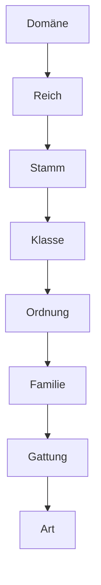

# Lebewesen

### Erklären Sie, was Evolution ist

Evolution beschreibt die Veränderung von Lebewesen über Generationen. Die Veränderung geschieht über **Mutationen**, dabei finden zufällige Veränderungen in Genen statt, die können positiv, wie auch negativ sein. Alle Tiere untergehen danach der Selektion, dabei überleben und vermehren sich nur die Tiere, welche am besten an die Umwelt angepasst sind, `Survival of the fittest`.

### Verstehen Sie einen phylogenetischen Stammbaum

In einem phylogenetischen Stammbaum zweigen alle Arten, welche von einem gemeinsamen Vorfahren stammen, von einem Ursprung, welcher jedoch meistens nicht klar bezeichnet wird. Dabei zeigen die Abstände zwischen Ästen die Verwandtschaftsverhältnisse von zwei Arten, je näher sie zusammen sind, desto näher sind sie zusammen verwand.

### Erklären Sie, nach welchem System Lebewesen sortiert werden

Dabei werden Lebewesen in immer genauere Gruppen eingeteilt, in welchen sie immer ähnlicher werden, bis man zur Art ankommt. Diese Gruppen sollen die Evolution darstellen. Die Gruppen in welche Tiere eingeteilt werden sieht so aus

### Erklären Sie, was man in der Biologie unter einer «Art» versteht

Unter der Namen Art wird ein Typ von einem Tier verstanden, welches nicht mehr genauer spezifiziert wird. Der Name ist definiert durch die Zusammensetzung der Gattung und der Art des Lebewesens.

### Erläutern Sie, wieso Antibiotika nur gegen Bakterien und nicht gegen Viren wirken

Antibiotika wirken gegen spezifische Teile bzw. Vorgänge einer Bakterie. Sie zerstören zum Beispiel die Zellwand oder verhinder die Proteinsynthese. Vieren haben jedoch einen komplett anderen Aufbau als Bakterien, weil sie keine Lebewesen sind, dadurch können die Antibiotika keine Viren angreifen.

### Erklären Sie, wie Bakterien resistent gegenüber Antibiotika werden und wieso das heutzutage häufiger geschieht

Bakterien können mutieren, diese Mutationen können verursachen, dass sich ein Bakterium verändert, sodass das vorhandene Antibiotika nicht mehr wirksam gegen das Bakterium wirkt.

Dies passiert heutzutage immer häufiger, weil Ärzte zu viel Antibiotika verschrieben, aber auch weil Patienten das Antibiotikum nicht bis zum Ende einnehmen und dadurch nicht alle Bakterien abtöten.

Einer der grössten Punkte, welcher die Antibiotikaresistenz steigert, ist jedoch die Massentierhaltung, weil dabei Antibiotika in grossen Mengen Tieren gegeben wird, um Infektionen vorzubeugen. Doch dieser Prozess führt dazu, dass Bakterien mehr Möglichkeiten haben, sich durchzusetzen gegen das Antibiotikum.## Erklären Sie, welche Funktion Bakterien auf und in unserem Körper haben

Baktereien finden man häufig auf der Haut und in den Verdaungsorganen. Auf der Haut dienen die Baktereien dazu, das Wachsctum von anderen Mikroorganismen zu verhindern. Im Darm zersetzen Baktereien Nahrung in Stoffe, welche für und nützlich sind.

### Beschreiben Sie, was eine Bakterienkolonie ist, und charakterisieren Sie sie morphologisch (mit Anleitung)

Eine Bakterienkolonie ist die Ansammlung von vielen Bakterien, meistens Millionen, welche sich vermehrt haben und sich weiterhin vermehren.

Sie können morphologisch charakterisiert werden, anhand der Form und Farbe.

### Interpretieren Sie eine logarithmische Wachstumskurve

Eine logarithmische Kurve zeigt auf der y-Achse nicht die wirkliche Einheit, sondern den Exponenten einer Zehnerpotenz. Dies heisst, dass ein Wert von $6$ auf der y-Achse, bedeutet nicht $6$, sondern $10⁶ = 1'000'000$.

Die Abschnitte in einer Wachstumskurve

- Eine Wachstumskurve beginnt mit der Anlaufphase, in welcher sich die Lebewesen an das Medium gewöhnen.

- Dies ist gefolgt von einer optimalen Wachstumsperiode, in welcher die Lebewesen sich exponentiell verändern können, weil sie genügend Nährstoffe haben.

- Dies wird gefolgt von einer Flachen oder sogar abnehmenden kurve, in welcher aufgrund von der Nährstoffknappheit mehr Bakterien absterben, als neue gebildet werden.

### Erklären Sie, was wir unter Bioremediation verstehen, verwenden Sie das Beispiel Abbau von Öl in der Umwelt

Unter Bioremediation versteht man den Gebrach von Organismen zum Entfernen von Verunreinigungen aus der Luft, Boden und Wasser.

Ein Beispiel dafür wäre die Unterstützung von Mikroorganismen beim Zersetzen von Öl. Dabei kann das Öl mit einem speziellen Dünger besprüht werden, welcher Bakterien im Erdboden stimulieren, das Öl schneller abzubauen.

### Erläutern Sie, aus welchen Stufen eine Kläranlage besteht und wie sie funktioniert

- In der `mechanische Reinigungsstuffe` werden grosse Verunreinigungen entfernt, Filtration und Sedimentierung. Zuerst werden mit einer Rechenanlage grosse Stücke entfernt. Danach wird die Fliessgeschwindigkeit abgesetzt, damit Sand und Fett zum Boden absinkt und entfernt werden kann. Dieser Prozess wird wiederholt, jedoch mit einer noch kleineren Fliessgeschwindigkeit, damit auch kleiner organische und anorganische Partikel sich absetzen.

- In der `biologische Reinigungsstuffe` wird hauptsächlich organischer Kohlenstoff und Stickstoff aus dem Wasser entfernt. Der Kohlenstoff wird mit Sauerstoff, mit der Zellatmung entfernt und der Stickstoff wird zu Nitrat. Dieses Nitrat wird dann unter aeroben Bedingungen zu Luftstickstoff umgewandelt.

- In der `chemischen Reinigungsstuffe` wird hauptsächlich Phosphat entfernt. Dabei wird Eisen dazugegeben, welches mit dem Phosphat Eisen-Phosphat bildet, welches sich am Grund absetzt.

### Beschreiben Sie die alkoholische Gärung und die Milchsäuregärung

Die beiden Gärungsarten finden bei der Glykolyse statt, welche eine Reihe von $10$ biochemischen Reaktion ist. Bei dieser Reaktion wird $\text{NADH}$, welcher ein ähnlicher Stoff zu $\text{ATP}$ ist entladen, dabei entstehen je nach Gärungsart verschiedene Produkte.

- Bei der `Milchsäuregärung` wird Lactat produziert

- Bei der `alkoholischen Gärung` wird Ethanol und $\text{CO}_2$ produziert.

### Beschreiben Sie den Aufbau und die Lebensweise des Parameciums, der Euglena, der Amöbe und der Chlorella als Vertreter der Protisten

Protisten sind keine einheitliche Gruppe gesehen aus der Evolutionssicht, sie sind die Restgruppe aller einzelliger eukaryotischen Lebewesen. Eukaryotische Lebewesen besitzen einen Zellkern.

- Das `Paramecium` besitzt Wimpern auf seiner Zellhaut, diese Wimpern helfen Nahrung das Mundfeld zu leiten. Diese Nahrung wird dann in Nahrungsvakuolen verpackt und verdaut.

- Die `Euglena` besitzt eine Geisel, mit der sie sich fortbewegen kann. Sie betreibt Photosynthese in ihren Chloroplasten, wenn Licht vorhanden ist, hingegen bei Dunkelheit kann sie jedoch Nahrung aufnehmen. Sie besitzt dazu einen Photorezeptor, der mit der Geissel gekoppelt ist, damit sie sich ausrichten kann.

- Die `Amöbe` kann ihre Form anpassen, besitzt aber Scheinfüsschen, mit denen sie sich fortbewegen kann. Mit diesen Füsschen kann sie ebenfalls Nahrung umschliessen und langsam verdauen.

- Die `Chlorela` ist eine einzellige Mikroalge und betreibt Photosynthese und ist.

### Erklären Sie die Mitose mit Prophase, Metaphase, Anaphase und Telophase

Die Mitose ist der Prozess der Zellteilung, bei welcher sich eine Zelle in zwei identische Tochterzellen teilt.

- Während der `Prophase` verdichtet sich die DAN im Zellkern zu Doppelchromosomen, welche aus zwei gestisch identischen Einzelchromosomen (Chromatiden) besteht, welche im Centromer verbunden sind. Während dies passiert, baut sich ein Spindelapparat aus fadenförmigen Proteinmolekülen auf.

- Während der `Metaphase` ist der Spindelapparat vollständig ausgebildet und mit den Chromosomen an den Centromeren verbunden, welche sich alle in der Mitte (Äquatorialebene) anordnen.

- Während der `Anaphase` werden die Doppelchromosomen an ihren Centromeren voneinander gelöst und von Spindelapparat an die Zellpole gezogen.

- Während der `Telophase` löst sich der Spindelapparat auf und durch die Bildung einer neuen Zellmembran entsteht zwei halb so grosse identische Tochterzellen.

### Beschreiben Sie, wie ein Schwamm aufgebaut ist und wie er sich ernährt

Schwämme sind sehr einfach aufgebaute Lebewesen ohne eine einheitliche Struktur. Sie bestehen aus einem Zyllinderähnlichen Körper, welcher drinnen hohl ist. Die Aussenwände bestehen aus zwei Zelltypen. Ganz aussen befinden sich begeisselte Zellen, welche Wasser durch den Schwammkörper strudeln, welcher aus Spicula Zellen besteht. Diese Zellen können aus dem Wasser Nährstoffe hinaus filtrieren. Das aufgenommene Wasser wird nach oben durch das Osculum herausgelassen.## Beschreiben Sie die asexuelle und die sexuelle Fortpflanzung

- Bei der `asexuellen` Fortpflanzung bilden sich aus einem Elternteil durch Zellteilung ein Nachkommen, welches genetisch identisch ist. Diese Art der Fortflanzung ist von Mutzen, wenn es keine gleiche Art in der nähe gibt.

- Bei der `sexuellen` Fortpflanzung werden die schliest sich das Erbgut von zwei Elternteilen zusammen und erstellt ein neues Nachkommen, welches verschieden von seinen Vorfahren ist. Diese Art der Forpflanzung bitet eine grössere Biologische Diversität.

### Unterscheiden Sie die Gruppen Algen, Moose, Farne, Nadelhölzer, Einkeimblättrige und Zweikeimblättrige

- `Algen` sind keine einheitliche Gruppe, sie sind eine Restgruppe, meistens definiert als alle eukariotischen Lebewesen, welche Photosynthese machen, aber nicht zu den Pflanzen gehören. Miestens sind Algen einzeller, jetoch gibt es auch mehrzellige und teils sehr lange Algen.

- `Mose` sind Pflanzen, welche selber kein Wasser transportieren können, sie müssen städnig mit Wasser in Kontakt sein und sich in feuchten und dunklen Orten befinden. Sie reporduzieren sich indem, die Spermien über Wasser zu den Eiern schwimmen.

- `Farne` können Wasser und Nährstoffe in Gefässen transportieren, sind also Gefässpflanzen. Sie vermehren sich aber nicht wie Pflanzen, sie bilden Spori, welcher eine ansammlung von Sporen sind, welche der Verbreitung dienen, aber nicht durch Befruchtung enstanden sind.

- `Nadelhölzer` sind Gefässpflanzenm, ihre Samen sind aber nicht in Fruchtknoten eingehült, wie bei vieln Pflanzen, sondern sind *nackt*.

- `Einkeimblättrige` Pflanzen, bilden nur ein Keimblatt in ihrer frühen Enstehungsphase. Dazu gehören Pflanzen, wie die Orchideen, Gräser und Palmen.

- `Zweikeimblättrige` Pflanzen, bilden im gegensatz zu den Einkeimblättrigen Pflanzen zwei Keimblätter und sind eine grosse Pflanzengruppe zu der kleien Kräuter, wie auch risiege Bäume gehören. 

### Erklären Sie den Lebenszyklus einer Blütenpflanze anhand einer eigenen Skizze und vergleichen Sie ihn mit dem des Menschen

Eine Blütenpflanze beinhaltet eine Eizelle, welche sich im Fruchtknoten befindet, diese wird durch männliches Pollenkorn befruchtet. Dieses Pollenkorn ensteht in Atheren an den Spitzen der Staubblätter. Der befruchtet **Zygot** entwicklet sich dann zu einem **Embryo**, um welchen herum eine Frucht wächst, mit einem Samen mitendrinn. Dieser Samen kann keimen und eine neue Pflanze wachsen lassen, welche den Kreisslauf schliesst. 

## Beschreiben Sie den Aufbau einer normalen Blüte sowie eines Korbblütlers

- In der Mitte einer `Blütenpflanze`  befindet sich die Samenanlage, zu welcher von Oben ein **Griffel** führt, welcher mit der **Narbe** endet, alle diese Teile werden zusamengefasst unter dem Begriff **Fruchtblatt**. Rumdherum befinden sich **Staubblätter**, welche aus dem **Blütenboden** herauswachsen und in **Antheren** enden. Unterhalb der Blüte wachsen `Kelchblätter` herum.
  
  - `Körbblüter` sind eine grosse Pflanzfamillie der Zweikeimblättrigen Pflanzen. Sie haben nicht einzelne Blüter, hingegen duzenten oder machnmal hunderte machmal vun Blätter, welche sich zusammen in einem *Korb* befinden. 

## Beschreiben Sie den Aufbau einer unverholzten Pflanze mit Funktionen der Wurzel, Sprossachse, Blätter, Blüte und Frucht

- Die `Wurzel` verankert die Pflanze im Boden und versorgt sie mit Wasser und Nährstoffen.

- Die `Sprossachse` auch Stängel gennant hält die Pflanze aufrecht.

- In den `Blätter` findet die Photosynthese statt.

- Die `Blüte` beinhaltet die Forpflanzungsorgane und ist farbig, um Tiere anzulocken.

- Die `Frucht` beinhaltet einen befruchteten Samen, welcher durch Tiere in Form der  süssen und schmackhaften Frucht gegessen wird und sich damit weiterverbreiten kann.

## Skizzieren Sie einen Baumquerschnitt mit Funktionen von Borke, Bast (Phloem), Kambium, Splintholz (Xylem) und Kernholz

- Die `Borke` ist eine Schutzschicht für die inneren Schichten.

- Das `Bast` leitet Nährstoffe, welche durch die Photosynthese produziert wurden.

- Das `Kambium` ist die einzige Schicht im Baum, welcher ihre Zellen, Mitose betreiben können und dadurch den Baum wachsen lassen.

- Das `Splintholz` befördert Wasser nach oben im Baum.

- Das `Kernholz` besthet aus abgestorbenen Zellen, welche mit Lingin gefüllt sind.

## Erklären Sie, wie Jahresringe bei Bäumen entstehen

Jedes Früjahr werden vom Kambium neue Zellen nach innen abgegeben. Bis zum Herbst wächst der Baum in dicke. Danach werden die neu gebildeten Zellen immer kleiner, bis das Wachstum komplet eingestellt wird. Die Zellen, welche sich bis zum Herbst bilden, sind viel heller, als die später. Dies sieht man im Querschnitt eines Baumes in abwechslenden dunklen und hellen Stellen, welche zusammen ein Jahresring sind. 

## Unterscheiden Sie Beeren, Steinfrüchte, Nüsse sowie Scheinfrüchte und Sammelfrüchte anhand des botanischen Aufbaus und mit

Früchte werden eingeteilt in Kategorien nachdem ob ihre Schichten um die Samenanlage, **holzig**, **fleischig** oder **häutig** sind. Die Drei schichten von aussen geshen heissen **Exokarp**, **Mesokarp** und **Endokarp**.

- Bei `Beeren` ist der Meso- und Endokarp fleischig und der Exokarp häutig. Beispiele für Beeren sind Heildebeeren, Tomaten, Gurken, Kiwi und Banan (Der Samen sind die klienen schwarzen Punkte)

- Bei `Steinfruchten` ist der Endokarp holzig, der Mesokarp fleischig und der Exokarp häutig. Beispiele für diese solche Früchte sind die Kokosnuss, Mangos, Himbeeren und Bambuss.

- Bei einer `Nuss` sind alle Schichten holzig. Dies Früchte sind Haselnüsse und Erdbeeren (Bei welchen di kleinen Punkte Nüsse sind).

- `Scheinfrüchte` sind speziell, weil weitere Pflanzenteile beteiligt sind. Diese wäre zum Beispiel Äpfel und Erdbeeren.

- `Sammelfrüchte` sind mehrer Früchte, welche zusammengewachsen sidn, wie die Himbeere, Ananas und Erdbeere.

## Skizzieren Sie den Aufbau eines Pilzes und nennen Sie die Funktionen der wichtigsten Strukturen

Der Pilz ist nur der oberflächiche Teil seines Mycel, welches mit dem Pilz ein kontinuirliches Hyphengeflächt ist. Der Pilhut dient der Forpflanzung, weil unter ihm der Pilz sporen bildet. 

## Erzählen Sie, wie sich ein Pilz ernährt

Der Pilz ernährt sich grösstenteils durch eine Symbiose mit einem Baum. Er bietet dem Baum Wasser und Nährstoffe, welche er durch sein grosses Myzelnetzwerk bekommt und bekommt dafürGlukose und weitere Kohlenhydrate vom Baum.

## Erklären Sie, was eine Flechte ist und wovon die beiden Partner profitieren

Eine Flechte ist eine Symbiose zwischen einem Pilz und einer Alge. Sie können zusammen sehr Lebesnunfreundliche orte besideln, an welchen die Alge austrochnen würde und der Pilz verhungern würde. 

## Erklären Sie, was Schleimpilze und was Schimmelpilze sind

- `Schleimpilze` bilden eine eigene Gruppe, da sie schwer einzuteilen sind. Einge sind Einzeller, welche sich mit anderen Zusammenfinden und wie ein mehrzeller agieren. Andere bilden Fruchtkörper und Sporen und können mit Schimmelpilzen verwechselt werden.

- `Schimmelpilze` sind ebenfalls keine systematische Gruppe sondern beziehen die oberirdischen, schnell wachsenden Hyphen gewisser Pilzarten. Schimmelpilze haben jedoch stets ein unterirdisches Myzel und einige Arten bilden Giftsotffe oder sogar krebseregende Stoffe.

## Sie können die typischen Merkmale eines Plattwurms am Beispiel der Planarie aufzeigen.

Ein Plattwurm ist ein **Gewebetier** mit Organen, wie einem Nervensystem, Nieren und Muskulatur. Es hat jedoch keine Atmungs- und Blutorgane. Die Planerei hat Augen und ein Zweiteiliges Gehirn, welches mit dem ventralen Nervensystem verbunden ist, welche durch den ganzen Körper führen. Mit diesem Gehirn, können sie hell und dunkel unterscheiden. Der Mund, welcher auch als After dient befindet sich am Bauch, welcher in einen Darm führt in welchem die Nahrung von den Aussenliegenden Zellen verdaut wird.

## Sie kennen den Lebenszyklus des kleinen Leberegels

Ein Leberegel infiziert als Wimpernlarve seinen 1. Zwischenwirt, wie Schnecken. Welche sich in der Schnecke zu Zekairen entwickeln und in Schleimbälchen vom 2. Zwischenwirt aufgenommen werden, wie Ameisen. Diese werden in Form einer Metazerkarie von Wirten aufgenommen, in denen sie sich zu adulten Tieren entwickeln. Diese legen dann Eiern aus denen wieder die Wimpernlarve wird.

## Sie können die Krankheitssymptome sowie Infektionswege des Fuchsbandwurms beim Menschen nennen

Der Fuchsbandwurm sieht den Menschen nicht als einen Wirt vor, der Mensch ist ein Fehlwirt, der sich zufällig mit den Eiern des Fuchsbandwurm infizieren kann. Dies kann passieren durch kontaminierte Nahrungsmittel oder infizierten Tieren. Die Krankheitssymptome tereten nach oft nach mehreren Monaten bzw Jahren auf, wenn die Organa anfnge zu versagen. Die Organ, welche der Wurm zerstört, sind die Lunge, Leber und das Gehirn.

## Beschreiben Sie die drei Klassen des Stamms der Ringelwürmer

- `Vielborster` besitzen Borsten und leben an Küsten oder Wattenmeeren, mamche von ihnen auch im Meer. Die meisten Vielborster leben oft räuberisch oder filtrieren Nahrung aus dem Wasser.

- `Egel` leben räuberisch oder als Parasiten und besitzt zwei Saugknöpfe einen am Kompf und einen am Hinterleib. Egel sind Zwitter, weisen damit also männliche und weibliche geschlechtsmerkmale auf.

- `Wenigborster` haben kaum borsitge Anhänge. Bei ihnen ist die Segmentation oftmals gut erkennbarn. Der bekanteste Regenwurm ist der Regenwurm.

## Erklären Sie, welche Organe ein Regenwurm besitzt und wo diese im Wurm zu finden sind

- Er besitzt einen `Mund` an der Spitze

- Er besitzt einen `Darm` durch seine ganze Länge

- Der Darm endet mit dem `After`

- Neben dem Darm befindet sich ein `Nervenstrang`

- Die `Herzen` des Wurm befinden sich vorne

- Die `Blutbahnen` befinden sich auf der ganzen Länge um den Darm herum

- Das `Gerhirn` befindet sich beim Mund

## Begründen Sie, in welchen Böden sich ein Regenwurm wohl fühlt und wie er im eigenen Garten hilft

# To learn

- Aufbau Schwamm & Meduse & Polyp

- Symetrinamen
