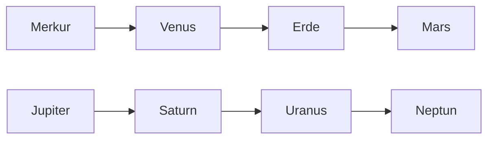

# Sonnensystem

### Ich kenne die Planeten unseres Sonnensystems und kann sie mit verschiedenen Eigenschaften umschreiben.

| Merkur, Venus, Erde, Mars  | Jupiter, Saturn, Uranus, Neptun         |
| -------------------------- | --------------------------------------- |
| Kleiner                    | Grösser                                 |
| Fest, aus Gestein          | Jupiter und Saturn aus Gas              |
| Metallkern                | Könnten über einen festen Kern verfügen |
| Hohe Dichten               | Jupiter und Saturn tiefe Dichten        |
| Kleine Massen              | Grosse Massen                           |
| Nahezu kreisförmige Bahnen | Besitzen Ringsysteme                    |

### Ich kenne die Definition eines Zwergplaneten und einige Namen

Um dies zu erklären, müssen zuerst die Kriterien für Planeten definiert werden

- Zwergplaneten erfüllen nicht die Kriterien für einen Planeten

- Planeten habe aufgrund ihrer Masse und der dadurch bedingten Eigengravitation eine annähernd `runde Form`

- Planeten *`befreien`* ihre Umgebung, damit ist gemein, dass sie in ihrer Umgebung keine freien Körper sich befinden können

Ein Zwergplanet ist ein Himmelskörper, der meistens das letzte Kriterium nicht erfüllt, ein Beispiel dafür wäre Pluto. Pluto erfüllt die ersten zwei Kriterien, aber in seiner Umgebung befinden sich weitere ähnlich grosse Objekte. Dadurch zählt Pluto nicht zu den Planeten, sondern zu einem Objekt vom Kuiper-Gürtel.
Andere Beispiele für Zwergplaneten sind

- Pluto

- Ceres

- Eris

- Makemake

- Haumea

### Ich kenne die Definition von Meteoriten, Asteroiden und Kometen

- `Asteroiden`: sind planetenähnliche Kleinkörper, die meistens unregelmässig geformt sind. Die meisten umrunden die Sonne auf einer Umlaufbahn zwischen dem Mars und dem Jupiter.

- `Komete` sind unregelmässig geformte Objekte aus Staub und Eis

- `Meteoriten` sind Bruchstücke von Kometen oder Asteroiden, die auf die Erde auftreffen.

### Ich kenne die Form der Erde und kann sie umschreiben

Die Erde ist eine Geode. Sie ist keine perfekte Kugel, sondern ist geformt durch Flüsse, Täler und Meeresboden. Sie ist ebenfalls am Äquator auseinandergezogen, wodurch ihr Querschnitt eher oval ist.

### Ich kenne den Unterschied zwischen Längen- und Breitengraden und kann ihnen verschiedene Eigenschaften zuordnen

- `Längengrade` beschreiben die Position in Ost – West Richtung. Sie führen von einem Pol zum andern, es gibt 360 von ihnen, der Nullpunkt wurde in London, Greenwich bestimmt. Man zählt dann 180 Längengrade in West und Süd Richtung.

- `Breitengrade` beschreiben die Position in Nord – Süd Richtung. Sie führen um die ganze Erde in Ost-West-Richtung, es gibt 180 von ihnen. Der Nullpunkt ist der Äquator, man misst dann 90 Breitengrade nach Nord und Süd. 

### Ich kann verschiedene Aussagen zur (speziellen) Unterteilung der Zeitzonenkarte machen

- Es gibt 24 Zeitzonen, jede mit einer Verschiebung von 1h zueinander. Zeitzonen werden jedoch oft nicht genau eingehalten, aus praktischen Gründen. Es kommt vor, dass Zeitzonengrenzen erweitert oder kürzt werden, damit Länder oder Städten nicht gespalten werden. In Ländern, die wirtschaftlich verbunden sind, wird ebenfalls oft probiert, die Zeit zu unifizieren.

- Es gibt aber Länder, bei denen Zeitzonen speziell sind:
  
  - Länder die geteilt sind durch Zeitzonen
    
    - USA
    
    - Australien
    
    - Russland
    
    - Brasilien
    
    - Demokratische Republik Kongo
    
    - Indonesien
  
  - Länder verschoben in Zeitzonen 
    
    - Russland +1h
    
    - Mittelaustralien +30min
    
    - Indien +30min
    
    - Iran +30min
  
  - Länder die Einheitlich sind
    
    - China erstreckt sich über 3 Zeitzonen, doch in ganz China herrscht die Zeit von Peking

### Ich kenne die koordinierte Weltzeit und deren Anwendungsbeispiele

- Die koordinierte Weltzeit, auch UTC genannt, ist die Uhrzeit von London, Greenwich. Man rechnet dann UTC + x h, dies wird geschrieben als UTC+x, z. B. UTC+1 ist unsere Zeitzone.

- Anwendungsbereiche von UTC
  
  - `Forschungsstationen` am Nordpol und Antarktis, wo Die Zeitzonen sich schneiden und es keinen Sinn macht die klassischen Zeitzonen zu verwenden.
  
  - Auf der `ISS` herrscht UTC
  
  - In der `Luft- und Schifffahrt` benutzt man UTC, damit es nicht zu Verwirrungen kommt. 
  
  - Im `Internet` wird ebenfalls als auf UTC umgerechnet, damit es zu keinen Konflikten kommt.

### Ich kenne den Unterschied zwischen Wetter und Klima und weiss, wie beide Grössen zustande kommen

- Das `Wetter` beschreibt den momentanen Zustand der Atmosphäre, an einem bestimmten Ort. Der grösste Zeitraum, den ein Wetter beschreiben kann, ist so lange bis sich die Wetterveränderung in Grenzen halten, dies ist maximal 1 Monat.

- Das `Klima` beschreibt einen Durchschnitt aus dem Wetter von einem grossen Zeitraum. Dieser Zeitraum darf nicht zu kurz gewählt sein, weil sonst es zu hohe Ausschläge gibt, aber auch nicht zu lange, weil sonst alles ineinander verlauft. Ein optimaler Zeitraum wären 30 Jahre.

### Ich kenne die Klimafaktoren und Wetterelemente

- Klimafaktoren
  
  - Lage zum Gebirge
  
  - Höhe und Entfernung vom Meer
  
  - Auf welchem Breitengrad
  
  - Bodenbedeckung

- Wetterelemente
  
  - Temperatur → Thermometer
  
  - Luftfeuchtigkeit → Hydrometer
  
  - Luftdruck → Barometer
  
  - Niederschlag → Niederschlagsmessgerät
  
  - Luftgeschwindigkeit → Anemometer
  
  - Luftrichtung → Windsack

