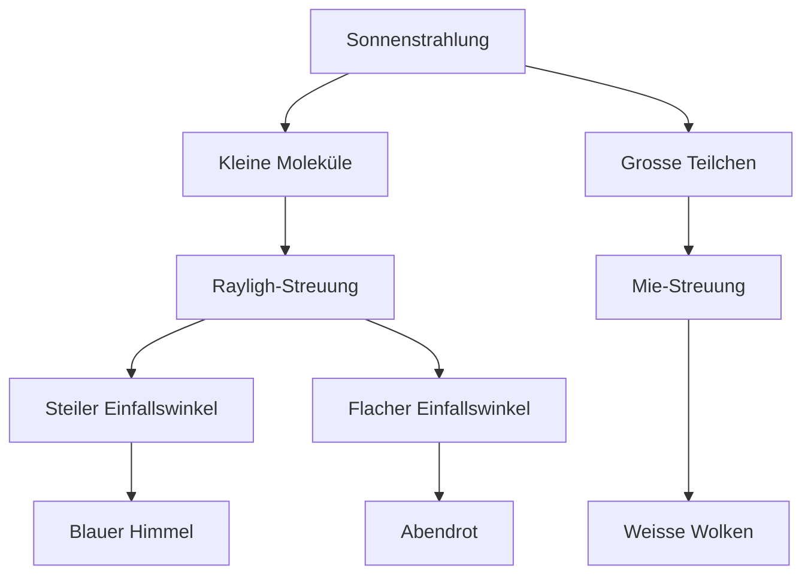

# Atmosphäre

### Sie kennen die verschiedenen Schichten der Erdatmosphäre und ihre Beschaffenheit und Funktion

Der Druck von der Erdatmosphäre sinkt von einem durchschnittlichen Wert von $1013 \space hPa$ auf der Oberfläche zu fast $0 \space hPa$ über $30 \space km$. Der Druckt steigt also exponentiell, desto näher an der Oberfläche man misst.

Die Temperatur der Erdatmosphäre folgt nicht einem klaren Trend. Die Temperaturkurve untergeht drei Trendänderungen. Diese Trendänderungen setzen die Grenzen für die einzelnen Schichten der Erdatmosphäre.

Die einzelnen Schichten der Erdatmosphäre sind

-   Die `Troposphähre` ist die Schicht, welche bis etwa bis $10 \space km$ über den Erdboden reicht. Wir Menschen sind mit dieser Schicht am besten vertraut. Alle Wettereignissen spielen sich in der Troposphäre ab. Die Grenze zur nächsten oberen Schicht heisst `Tropopause`.
    
-   Die `Stratosphäre` geht bis auf etwa $50 \space km$ über den Erdboden. In der Stratosphäre fliegen Wetterballone und manche Flugzeuge. Die Stratosphäre enthält die Ozonschicht mit dem Ozon $\text{O}_3$, welches Menschen vor ultravioletter Strahlung schützt. Die Grenze zur nächsten Schicht wird `Stratopause` genannt.
    
-   Die `Mesosphäre` endet auf einer Höhe von etwa $85 \space km$. In dieser Schicht verglühen die meisten kosmischen Objekte, welche in die Erde eindringen. Manchmal nach Sonnenuntergang sind Wolken in dieser Schicht zu sehen, welche das Licht der Sonne noch reflektieren können, wegen ihrer Höhe. Die Grenze über der Mesosphäre trägt den Namen `Mesopause`.

### Sie können Streuung in der Erdatmosphäre erklären

Streuung findet statt, wenn sich die Ausbreitungsrichtung von Strahlung ändert, wenn sie auf einen Streukörper trifft. Jedoch muss ihre Wellenlänge und damit auch die Frequenz erhalten bleiben.

Das Sonnenlicht, welches auf durch die Erdatmosphäre dringt, untergeht der Streuung und weniger als die Hälfte trifft nicht mal auf die Oberfläche. Doch die Strahlung, welche die Oberfläche erreicht, wird `diffuse Himmelsstrahlung` genannt.

Streuung kommt auf in der Erdatmosphäre in zwei Formen vor

-   Die `Rayleigh-Streuung` findet statt, wenn sichtbare Strahlung auf Körper trifft, die viel kleiner sind, als die Wellenlänge der Strahlung. Solche Streukörper sind unter anderem Moleküle wie `Stickstoff, Sauerstoff, Argon und Kohlenstoffdixid`. Doch Strahlung mit kürzerer Wellenlänge (blau) wird stärker gestreut, als die mit kurzer (rot).
    
    Die Rayleigh-Streuung kann erklärt werden mit drei Ereignissen
    
    -   Der `blaue Himmel` entsteht, wenn weisses Sonnenlicht in die Atmosphäre eindringt und an den einzelnen Körpern gestreut wird. Dabei wird blaues Licht stärker gestreut, was den Himmel blau erscheinen lässt.
        
    -   Das `Abendrot` entsteht, wenn die Sonne tief am Horizont steht und das Sonnenlicht eine lange Strecke überwinden muss durch die Erdatmosphäre. Dabei wird das blaue Licht so stark gestreut, dass hauptsächlich rotes Licht bei uns ankommt.
        
    -   Man kann auch Sonnenbrand unter einem Sonnenschirm bekommen, weil wegen der Rayleigh-Streuung auch UV-Strahlen  in alle Richtungen gestreut werden, welche auf Körper unter direktem Sonnenschutz treffen können.
        
-   Die `Mie-Streuung` findet statt, wenn die sichtbare Strahlung auf Körper trifft, welche viel grösser sind, als die Wellenlänge der Strahlung. Solche Objekte sind unter anderem `Wassertröpchen, Eisnadeln und grösse Aewrosole`. Bei der Mie-Streuung wird keine Wellenlänge bevorzugt.
    
    Diese Streuung ist gut zu erkennen an Wolken, dabei wird die sichtbare Strahlung bestehend aus dem ganzen sichtbaren Spektrum an den vergleichsweise grossen Wassermolekülen gestreut in alle Richtungen. Dies lässt die Wolken weiss erscheinen. Graue Wolken entstehen, wenn weniger Licht durchgelassen wird, wegen ihrer dichteren Zusammensetzung.

Diese Streuunarten können in einem Diagramm repräsentiert werden

### Sie können die Energiebilanz der Erde erklären

Die Erde erhält durchschnittlich 1367 $\frac{W}{m²}$ von der Sonne, dieser Wert kann auch als `Solarkonstante` bezeichnet werden, obwohl er nicht konstant ist. Er ändert sich mit der Entfernung der Erde von der Sonne und der Aktivität der Sonne. Mit der Neigung der Drehachse ist dieser Effekt, aber nicht zu erklären, weil es ein durchschnittlicher und die Jahreszeiten auf der Erde sich immer im Wechselspiel befinden.

Die Erde heizt sich aber nicht immer weiter auf, weil die eingestrahlte Energie wieder zurück abgestrahlt wird in den Weltraum. Es ist ein Gleichgewicht zwischen einstrahlender und abstrahlender Energie.

### Sie können beschreiben, was der Treibhauseffekt ist und was für Bedeutungen er auf der Erde hat

Der Treibhauseffekt ist die Wirkung von Treibhausgasen in der Atmosphäre, welche Wärmestrahlung absorbieren und so die Temperatur der Erdoberfläche vergrössern. Kurzwellige Sonnenstrahlung kann problemlos in die Erdatmosphäre eindringen und wird zu Wärmestrahlung absorbiert von verschiedenen Molekülen und überträgt ihnen dabei Energie in Form von Wärme. Diese ganze Wärmestrahlung entflieht aber nicht der Erdatmosphäre, sondern wird zum Teil weiterhin absorbiert an den Treibhausgasen in der Atmosphäre. Natürliche Treibhausgase sind

-   Wasser ($\text{H}_2 \text{O}$) in Form von Dampf ist das wichtigste Treibhausgas und entsteht beim Verdampfen von Wasser
    
-   Kohlenstoffdioxid ($\text{CO}_2$) entsteht bei Vulkanausbrüchen, Waldbränden und Stoffwechsel
    
-   Ozon ($\text{O}_3$) reflektiert Wärmestrahlung nahe an der Erdoberfläche, das Ozon in der Ozonschicht hat keine Einwirkung auf den Treibhauseffekt
    
-   Lachgas ($\text{N}_2 \text{O}$) gelangt besonders durch Düngung in die Atmosphäre
    
-   Methan ($\text{CH}_4$) entsteht in den Verdauungstrakten von Wiederkäuern, aber auch bei anderen Tieren 

### Sie können die Ursache und Folgen des anthropogenen Treibhauseffekts erklären

Durch anthropogene oder menschliche Aktivitäten wird der Treibhauseffekt verstärkt, in dem der Mensch ein Übermass an Treibhausgasen produziert. Die wichtigsten Treibhausgase, die der Mensch produziert, sind

-   Kohlenstoffdioxid ($\text{CO}_2$) entsteht bei der Verbrennung von fossilen Brennstoffen und Waldrodung
    
-   Methan ($\text{CH}_4$) entsteht in Müllwerken, Kläranlage, Landwirtschaft und Verbrennung von fossilen Stoffen
    
-   Lachgas ($\text{N}_2 \text{O}$) entsteht immer mehr durch die sich vergrössernde Landwirtschaft
    
-   FCKW ($\text{FCKW}$) wird nur von Menschen produziert. Dieses Gas wurde früher vor allem bei der Kühlmittel und Spraydosen Produktion erzeugt, heute ist es aber verboten.
    
-   Ozon ($\text{O}_3$) wird indirekt produziert von Autos, welche Stickstoffdioxid ($\text{NO}_2$) abstossen, welches sich dann mit der umgebenden Luft zu Ozon verbinden kann.

