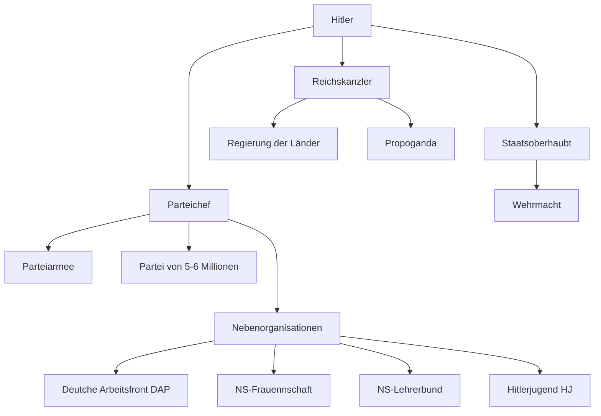

# Zwischenkriegszeit & 2. Weltkrieg

## Zwischenkriegszeit

### Ich kenne den Vertrag von Versailles und dessen Inhalt

Der Vertrag von Versailles beendete offiziell den 1. Weltkrieg. Er wurde von den Vertretern der jungen Weimarer Republik unterschrieben. Er forderte eine Demilitarisierung von Deutschland und Zahlungen von Reparaturkosten an Frankreich und Grossbritannien für die Schäden. Dabei sollte Deutschland und seine Verbündeten als Kriegsschuldige gelten und Land abgeben.

### Ich kann mit meinen eigenen Worten erklären, wie die Weimarer Republik aufgebaut ist

Das politische System der Weimarer Republik besteht nur aus der Legislative und Exekutive. Dabei beinhaltet die Legislative aus 2 Kammern. Im Reichstag befinden sich Abgeordnete, welche direkt vom Volk gewählt werden. Der Reichsrat ist die 2. Kammer, welche aus Abgeordneten von den Bundesländern aufgebaut ist und kann Widerspruch gegen vorgeschlagene Gesetze geben. Die Exekutive besteht aus dem Reichskanzler und seinen Ministern; sie wurden auch Reichsregierung genannt. 

Über diesen Positionen steht der Reichspräsident, oder auch «Ersatz Kaiser» genannt. Er ernennt und entlässt den Reichskanzler und kann die Auflösung des Reichstags befehlen. Er hat ebenfalls die Kontroller über die Reichswehr.

Die Nachteile dieses Systems waren:

- Der Reichspräsident darf den Reichstag unbegrenzt auflösen

- In Notfällen können Rechte aufgehoben werden, ohne eine bestimmte Zeitspanne

- Die Judikative wurde in die Regierung nicht ein bezogen

Das deutsche Volk war zu dem nicht an eine Demokratie gewohnt, nach den Jahren unter der Herrschaft eines Kaisers. Die grosse Spaltung zwischen Faschismus und Kommunismus zerstörte jegliche Kooperation im Land. Die junge Republik konnte nicht die Reparaturzahlungen begleichen und musste sich verschulden, was zur Hyperinflation führte.

### Ich kann die Russische Revolution umschreiben und weiss, wie Lenin und Stalin das Land geführt haben

Das russische Volk ist sehr unzufrieden, wegen schlechter Bezahlung und Arbeitszuständen. Es wird probiert, in vielen blutig niedergeschlagenen Aufständen dem alleinherrschenden Zaren klarzumachen, dass man bessere Arbeitszustände und Demokratie fordert. Nach einer Zeit gibt der Zar ein und bildet ein Parlament, doch er ist immer noch an der Spitze und es ändert sich nicht vieles. Während des 1. Weltkriegs, wo die Bevölkerung von Russland von Hunger leidet, gibt es eine gewaltige Revolution, welche sich die kaiserlichen Truppen teilweise anschliessen. Der überwältigte Zar muss zurücktreten. Daraufhin wird eine provisorische Regierung gebildet, die aber den Krieg fortsetzt. Als «Rettung» kommt Vladimir Lenin, welcher als extremer Sozialist, mit seinem Anhänger, den Bolschewiki, eine neue Regierung bilden will. Er stürmt (fast keine Gewalt) den Regierungssitz und ernennt sich zum Staatsoberhaupt. Seine ersten Schritte waren: Das Land auf die Bauern zu verteilen und den Krieg zu stoppen. Lenins Regierung versorgt das Volk mit dem Nötigen, was ihn sehr beliebt macht unter dem Volk und einzelne politische Gegner werden beseitigt. Nach dem Tod von Lenin wird Joseph Stalin zum neuen Staatsoberhaupt. Er wollte aus Russland einen Industriestaat machen, dabei sollte das Einkommen aus der Landwirtschaft in die Industrialisierung einfliessen. Stalin plane eine Planwirtschaft, wo jeder Industriezweig harte Ziele bekam und wenn er diese nicht einhielt, könnte der Besitzer wegen Sabotage angeklagt werden.

### Ich kann das Leben der Leute zur Zeit der Goldenen 20er Jahre in Deutschland erklären

Die Goldenen 20er Jahre sind die Zeit zwischen dem 1. Weltkrieg und der Weltwirtschaftskrise, wo die Weimarer Republik einen enormen Aufschwung erlebte. Dies konnte erreicht werden, weil amerikanische Banken den deutschen Banken Geld geliehen haben, welche dieses dann weiter leihen an Industrie. Somit gab es mehr Arbeitsplätze und die Industrie hat den Stand von vor dem 1. Weltkrieg überholt. Menschen zogen in die Stadt, deswegen fehlte es an Arbeitskräften auf dem Land und wegen moderner Produktion war die Arbeitslosenquote immer noch recht hoch. Doch die meisten Menschen hatten damals Geld und wollten ihr Leben wieder geniessen nach dem Schrecken des 1. Weltkriegs.

### Ich kenne die ökonomischen und politischen Folgen der Hyperinflation in Deutschland und der Weltwirtschaftskrise

Der Versailler Vertrag sah vor, dass die Weimarer Republik den Alliierten Reparationsleistungen zahlen muss, doch die zerstörte deutsche Wirtschaft nach dem 1. Weltkrieg konnte sich dies nicht leisten. Dazu hat der Staat angefangen, mehr Geld zu drucken, was zu einer Inflation führte. Deutschland konnte nicht aufhören Geld zu drucken, weil sie sonst nicht in der Lage wären den Alliierten zu zahlen, welche auf Deutschland grossen Druck ausübten. Als Lösung wurde eine neue Währung eingeführt, die aber erst durch US-Kredite stabilisiert wurde. Die Weltwirtschaftskrise (24.10.1929)bewirkte, dass die US-Banken ihre Kredite zurückwollten und die deutsche Wirtschaft brach wieder in sich zusammen. 

Die Schuld für diese Umstände wurde von vielen auf die damalige provisorische Regierung geschobene und dies gab andere, wie Adolf Hitler die Macht zu übernehmen. 

### Ich kann den Aufstieg der NSDAP beschreiben und kenne die wichtigsten Meilensteine

Hitlers Ziel war es, ein absoluter Herrscher in Deutschland zu werden. Hitler hat sich als Parteichef der NSDAP (National sozialistische Deutsche Arbeiterpartei) als Kanzler vorgeschlagen und wurde angenommen durch den älteren, leicht manipulierbaren Reichspräsidenten Hindenburg.

- 
30. Januar 1933     Hitler wird Kanzler

- 
28. Februar 1933   wegen Auflösung des Parlaments → Notverordnung

- 
05. März 1933        Neuwahlen und die NSDAP gewinnt die Mehrheit

- 
23. März 1933        Ermächtigungsgesetz, Hitler darf alleine regieren

- 
02. August 1934     Hindenburg stirbt, Reichspräsident wird aufgelöst

### Ich kenne das politische und gesellschaftliche System, das Adolf Hitler mit einer Machtübernahme durchgesetzt hat

Gesellschaftliches System: Das System fing schon bei Kindern an, welche erzogen wurden Dinge zu tun, welche auch in einem Krieg Anwendung haben. Dazu gehörten Aktivitäten, wie: Nähen, sich um Kranke kümmern, Schiessen, Geländespiele und Sport. Behinderte Kinder wurden sehr stark benachteiligt und ausgeschlossen; «Nicht-Arier» waren ebenfalls nicht das Idealbild. Es gab eine extreme Teilung, welche Arbeiten für welches Geschlecht waren. Das Idealbild einer Familie, ein starker Mann, welcher die Familie beschützen sollte und bereit sein auf den Krieg. Die Frau sollte gesund sein und dem deutschen Volk Kinder bringen.

Politisches System: Hitler hat nach seiner Machtübernahme verschiedene Regierungsorgane aufgelöst oder kontrolliert, sodass diese ihn nicht abwählen könnten. Mit dieser Neuziehung von Strängen hat er die Gewaltenteilung zerstört und Deutschland zu einer Diktatur umstrukturiert.

### Ich weiss, wie das Gedankengut der Nationalsozialisten in die Köpfe der Menschen eingetrichtert wurde.

Kinder wurden von klein auf in die HJ (Hitlerjugend) geschickt, um ihnen die Propaganda beizubringen. Dabei gingen die Knaben zwischen 10 und 14 Jahren in das Jungvolk und die Mädchen zu den Jungmädeln. Später gingen die Mädchen in den BDM (Bund Deutscher Mädel), welcher ihnen die Ideologie beibrachten, welche sie ihren Kindern beibringen müssten. Doch auch der Unterricht sollte Propaganda vermitteln; damals wurde Kindern das Rechnen mit militärischen Objekten beigebracht und das Lesen lernt man mit Texten, die besagen, dass Hitler ein Held sei. Und später rechnet man mit den Kosten von Behinderten Personen für den Staat.

Die Erwachsenen mussten sich einordnen, oder sonst würden sie bestraft werden oder müssten sogar ihr Leben hinhalten. Sie mussten also alles machen, was die NSDAP wollte und nicht herausragen.

### Ich kenne die Richtziele von Adolf Hitler und weiss, mit welchen  nicht kriegerischen Massnahmen das Staatsgebiet von Deutschland erweitert wurde

Hitlers Endziel war es, das deutsche Reich auf die ganze Welt zu expandieren. Doch seine ersten Ziele waren, den Vertrag von Versailles zu beseitigen, alle Deutschen zurück ins Reich zu holen, Raumgewinnen im Osten, um Platz für Deutsche zu machen. 

Hitler hat Propaganda eingesetzt in den Ländern, die er annektieren wollte, damit diese Wahlen veranlassen würden, um zu klären, ob sie zu Deutschland gehören wollen. Doch in gewissen Fällen marschierte auch die Wehrmacht ein und wurde von der Bevölkerung akzeptiert.

### Ich kenne den Hitler-Stalin-Pakt und dessen Bedeutung für das Land und die Einwohner Polens

Dieser Pakt, auch Molotow-Ribbentrop-Pakt genannt, wurde im Namen der UdSSR und Nazideutschland unterschrieben am 23. August 1939 unterschrieben. Er besagte, dass die beiden Parteien sich über 10 Jahre nicht angreifen werden und ihre Gegner nicht unterstützen. In einem geheimen Zusatzprotokoll wurde geregelt, wie das Land bei einer potenziellen Invasion auf Polen aufgeteilt werden sollte. Deutschland hat diesen Vertrag vorgeschlagen, weil sie auf jeden Fall einen 2 Fronten Krieg vermeiden wollten.

### Ich kenne die Reaktion von Grossbritannien und Frankreich auf das aggressive Auftreten Deutschlands

Die Hauptgegner von Hitler haben sein Auftreten akzeptiert, um einen Konflikt zu vermeiden, der sehr destruktiv enden könnte. Diese Art der Aussenpolitik wird als Appeasement-Politik bezeichnet.

## 2. Weltkrieg

### Ich kenne den Kriegsverlauf in groben Zügen, kann entscheidend Ereignisse benennen und ihn anhand einer Karte erklären

- 01.September 1939 &emsp; Invasion auf Polen

- 10.Mai 1939 &emsp; &emsp; &emsp; &emsp; &nbsp;Angriff auf Frankreich

- März 1941  &emsp; &emsp; &emsp; &emsp; &emsp; Beginn Afrikafeldzug

- 22.Juni 1941  &emsp; &emsp; &emsp; &emsp; Überfall UdSSR

- Herbst 1941 &emsp; &emsp; &emsp; &emsp; &nbsp;Blitzkrieg scheitert

- 7.Dezember 1941  &emsp; &emsp; Angriff auf Pearl Harbor

- Januar 1943  &emsp; &emsp; &emsp; &emsp; &nbsp; Deutsche Niederlage in Stalingrad

- 6.Juni 1944  &emsp; &emsp; &emsp; &emsp; &emsp; Landung der Alliierten in der Normandie: D-Day

- 12.September  &emsp; &emsp; &emsp; &emsp; Alliierte treffen im Westen auf Deutsches Gebiet

- 21.April 1945  &emsp; &emsp; &emsp; &emsp; Kampf um Berlin

- 30.April 1945  &emsp; &emsp; &emsp; &emsp; Selbstmord von Hitler

- 8.Mai 1945  &emsp; &emsp; &emsp; &emsp; &emsp; Kapitulation Deutschland

- 15.August 1945  &emsp; &emsp; &emsp; Kapitulation Japan

### Ich kenne die Taktik der Deutschen und weiss um deren technologischen Vorsprung

Die Deutschen haben sich auf den 2. Weltkrieg über Jahre vorbereitet, mit Produktion von Flugzeugen, Schiffen und motorisierten Waffen. Ein Land wie Polen, welches noch mit Pferden und Handwaffen arbeitete, hatte keine Chance gegen deutsche Panzer. Deutschland griff ebenfalls die Gebiete: Norwegen, Dänemark, Belgien, Niederlande, Österreich und Tschechoslowakei, über die sie andere Gegner invasiveren konnten.

Die Taktik der Deutschen war der Blitzkrieg, dabei sollte der Gegner mit Überraschung angegriffen werden und so schnell wie möglich besiegt, oder zur Kapitulation gezwungen werden.

### Ich kann verschiedene Wendepunkte im 2. Weltkrieg benennen und weiss um deren Auswirkung auf den Kriegsverlauf

- In Stalingrad mussten sich deutsche Truppen ergeben, was das Ende des Vorrückens von Deutschen in der UdSSR bedeutete. Danach wendete sich die Situation und die UdSSR drang nach Deutschland vor.

- D-Day war die Aktion, wo die Alliierten Deutsche Stellungen in der Normandie durchbrachen und die Deutschen zurückdrängten. Die Alliiertem konnten danach Häfen aufbauen in Nordfrankreich und eine Offensive starten.

- Zusammenbruch der Deutschen Offensive in Berlin. Die UdSSR dringt bis in die deutsche Hauptstadt ein und ein Kampf mit riesigen Verlusten auf beiden Seiten beginnt. Vor einer absoluter Niederlage begeht Hitler Selbstmord.

- Atombomben auf Hiroshima und Nagasaki. Durch die Atombomben, welche mehrere Hunderttausend Opfer vorderen, kapitulierte Japan schliesslich.

### Ich kann erklären, auf welche grausame Art und Weise die Nationalsozialisten einen Vernichtungskrieg gegenüber Zivilisten geführt haben

Am meisten mussten die Jüdische und bolschewistische Bevölkerung leiden. Die Stufen der Judenverfolgung waren

- Boykott jüdischer Läden

- Nürnberger Rassengesetz

- Pogromnacht/Kristallnacht - Zerstörung von Synagogen

- Deportationen in Quartiere

- Deportationen in Konzentrationslager 

Die Bolschewiki, hauptsächlich die politischen Kommissare, bekam keine Gnade, sie waren im Krieg gegen die UdSSR sofort zu erschiessen. Der Soldat hat ebenfalls jedes Recht als Kriegsgefangener verloren. Frauen und Kinder sollten auch umgebracht werden, wenn es einen kleinsten Verdacht hätte, dass sie sich am Krieg beteiligten.

### Ich kenne das Kriegsende und dessen Folgen für Europa und Japan

Das Kriegsende in Europa wurde gesetzt durch die Kapitulation der Wehrmacht und der Einnahme von Deutschland durch die UdSSR und der USA. Im Nachhinein wurde Deutschland aufgeteilt auf die 4 Gewinnermächte: Frankreich, Grossbritannien, die USA und die UdSSR. Die Alliierten Teile schlossen sich zusammen zur BRD oder Bundesrepublik Deutschland und der Teil der UdSSR wird zur DDR oder Deutsche Demokratische Republik. Die Hauptbefehlshaber wurden danach vors Gericht gestellt in Nürnberg, wobei die Meisten das Urteil des Todes bekommen haben, wenn sie sich schon nicht selber das Leben genommen haben.

Nach der Kapitulation von Deutschland war der Krieg noch nicht vorbei, die Japaner wollte weiter gegen die USA kämpfen. Die USA wussten, dass sie in der Lage wären Japan zu vernichten, aber unter enormen Verlusten auf beiden Seiten, welche auf keinen Fall kapitulierten wollte. Die 2 Atombomben auf Hiroshima und Nagasaki zwingen schlussendlich Japan sich zu ergeben.
